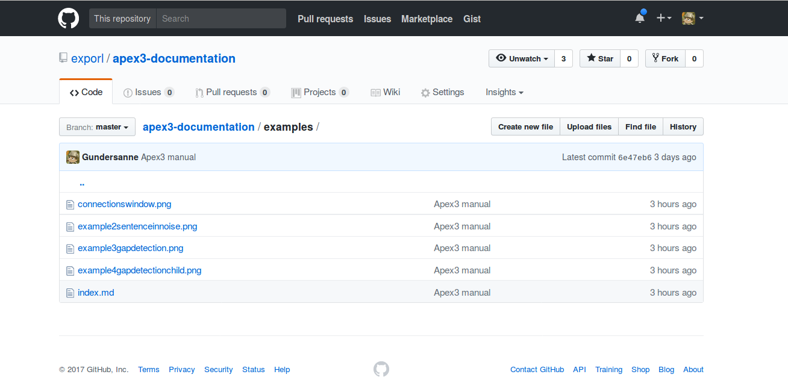
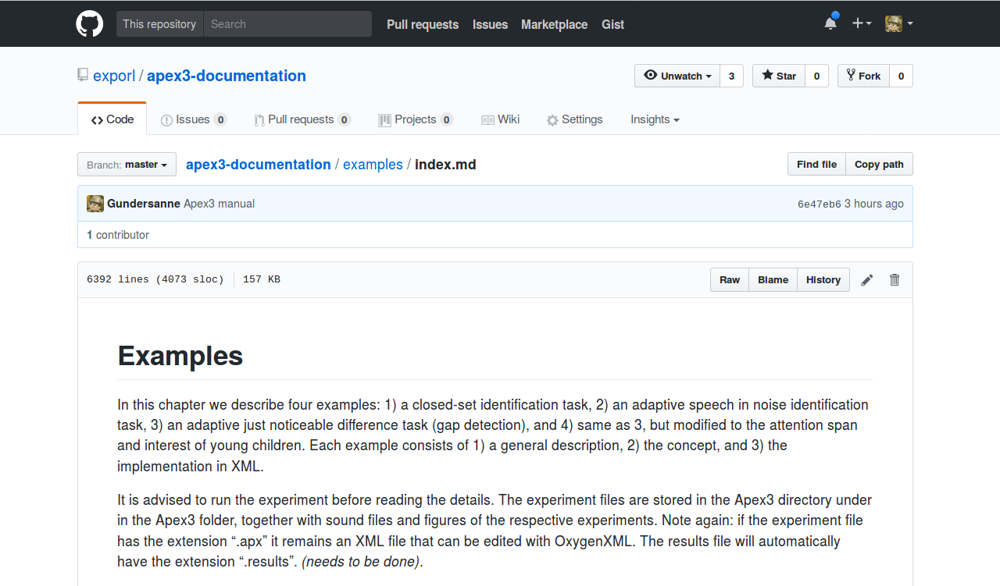
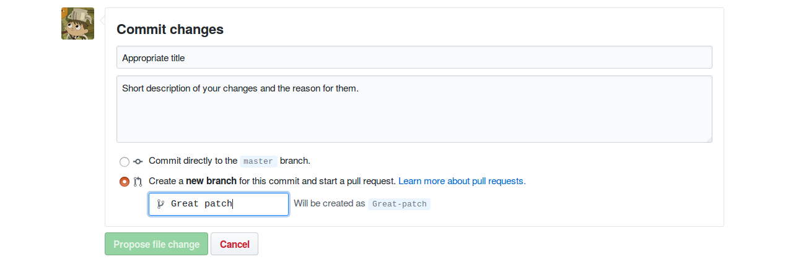
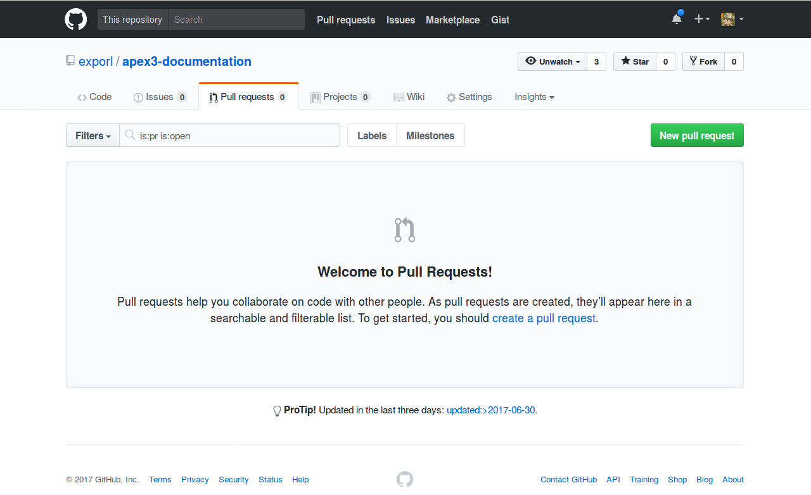

# How to contribute

## Markdown

The Apex manual uses [Markdown](https://en.wikipedia.org/wiki/Markdown), a simple
markup language. For a quick overview see
[Mastering Markdown](https://guides.github.com/features/mastering-markdown).


When you browse the Apex manual [repository]({{ site.github.repository_url }})
you'll notice that each topic has a directory which contains an index file. This
index file is shown when you navigate to a topic.

The examples folder with the index file:


## Editing

### Edit online via Github

You can edit these files online in Github. Simply click on *index.md* and click
on the pencil icon to the right.



Make changes as you see fit in the editor. Afterwards scroll down and commit your change.
Github will create a new branch for your commit and will generate a pull request[^1].



Your changes will be reviewed and you will be asked to modify your proposed changes
where necessary. Once approved your changes will be incorporated into the manual.

To see open pull requests, navigate to the Pull requests page:


### Edit locally

The Apex manual is really just a Git repository. So of course you can also
fork, clone, edit locally, push to your own repo and create a pull request.
For more information consult [the Github help pages](https://help.github.com/articles/fork-a-repo/).

## Note on style

The manual is not as consistent with style and formatting as it should be. We aim to improve this.
A few tips to make sure your patch gets approved more easily:

* Avoid trailing whitespace.

* When inserting code be sure to include the language right after the opening tag
(for instance `` ` ```` ` ```` ` ``  xml). This will apply syntax highlighting to the block of code.

* Proper use of titles and subtitles.

* Avoid lines longer than 100 characters, that way the pages
are friendly to all editors.

## Note on multiple pages

Because of the way the documentation was converted from LaTeX to Markdown, every topic
is contained within a single (index) page. However, feel free to create a new page within a topic,
be sure to provide a link to that page from that topic's index page.

If you want to add a new topic, make a new directory and a new index page.
Update the _layout/default.html to provide a link to your topic in the sidebar.

[^1]: For more information about pull requests consult [the Github help pages.](https://help.github.com/articles/about-pull-requests/)
